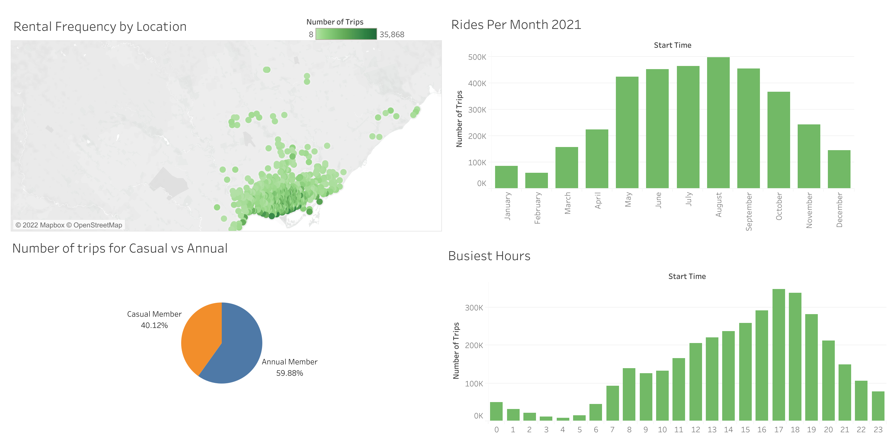

# Toronto Bike Share Analysis

Description: A data analysis project exploring ridership data from Bike Share Toronto, a bicycle sharing system in the city of Toronto.

About the dataset: Data obtained from [here](https://open.toronto.ca/dataset/bike-share-toronto-ridership-data/) for the year 2021. Contains anonymized trip data for bicycle trips throughout 2021, including Trip ID, Trip start and end times, Trip duration, Start and end station, User type, and Bike ID.

The data was first cleaned using Python, with longitude and latitude coordinates added for each start and end station via web scraping. [A direct link to the code can be found here.]([https://github.com/adamsami-62/Toronto-Bike-Share-Analysis/blob/main/Bike_Share_Analysis_Full_Process.ipynb](https://github.com/adamsami-62/Toronto-Bike-Share-Analysis/blob/main/Bike%20Share%20Analysis%20Full%20Process.ipynb))

Analysis and visualization was then done in Tableau. Full results can be found here: [Tableau Dashboard](https://public.tableau.com/views/AnalysisofTorontoBikeshareData_17746518205450/Dashboard1?:language=en-US&:sid=&:redirect=auth&:display_count=n&:origin=viz_share_link)

